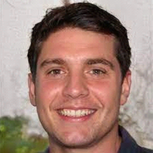
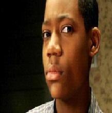

# Especificações do Projeto

Pré-requisitos: <a href="1-Documentação de Contexto.md"> Documentação de Contexto</a>

A definição exata do problema e os pontos mais relevantes a serem tratados neste projeto foi consolidada com a participação dos usuários em um trabalho de imersão feito pelos membros da equipe a partir da observação dos usuários em seu local natural e por meio de entrevistas. Os detalhes levantados nesse processo foram consolidados na forma de personas e histórias de usuários.

## Personas

As personas levantadas durante o processo de entendimento do problema são apresentadas nas figuras que se seguem:	

## **AMANDA ALVES**

**IDADE**: 28 anos

 **OCUPAÇÃO**: Biomédica, atua no campo de análises clínicas na cidade de Cuiabá, onde mora há 5 anos depois de se mudar de São Paulo.

**APLICATIVOS**: 

⦁ Instagram 

⦁ Facebook

⦁ Whatsapp

⦁ Linkedin

⦁ Aplicativos de Bancos

⦁ Entrega de comida.

**MORA EM**: Cuiabá, MT.

**INTERESSES**:

⦁ Vôlei

⦁ Cinema

⦁ Viagens

⦁ Leitura e ajudar cães abandonados.

**MOTIVAÇÕES**:

⦁ Ter reconhecimento.

⦁ Ajudar pessoas.

⦁ Construir uma família.

⦁ Deus.

**FRUSTRAÇÕES**:

⦁	Não poder ajudar todos os animais abandonados.

⦁	Não ter tempo suficiente para viagens.

⦁	Não poder visitar a mãe, que mora em São Paulo, com frequência.

⦁	Não conseguir comprar a casa dos sonhos.

**CRESÇA E RESUME HISTÓRIA**:

⦁	Católico

⦁	Nascida em São Paulo, é cristã, gosta de ajudar pessoas necessitadas nas horas vagas e cães abandonados.Tem 28 anos e atua no ramo da biomedicina há 4 anos.

**HÁBITOS DE COMPRA**:

⦁	Compras online, por ser mais prático e por ter acesso a muitas lojas. Menos frequente, lojas físicas.

**QUEM A INFLUENCIA**:

⦁	Shinya Yamanaka.

⦁	Jesus.

⦁	Seus pais.

**ESTILO DE VIDA**:

⦁	Gosta de ler e viajar aos finais de semana.

## **CARLOS GOMES** 

**IDADE**: 33 anos

**OCUPAÇÃO**: Engenheiro de Minas, atua no ramo de exploração de minérios para exportação em uma multinacional.

**APLICATIVOS**: 

⦁	Facebook

⦁	Linkedin

⦁	Aplicativos de Bancos

⦁	WhatsApp

⦁	Instagram

⦁	Tiktok

**MORA EM**: Jacobina, BA.

**INTERESSES**: Rochas, vida selvagem e felinos domésticos, futebol, churrasco e natação.

**MOTIVAÇÕES**: 

⦁	Ascensão no emprego

⦁	Estudar e ser o melhor em sua área.

⦁	Comprar um bom carro.

⦁	Ajudar os pais.

**FRUSTRAÇÕES**:

⦁	Não ter a casa própria.

⦁	Viajar pelo trabalho com frequência.

**CRESÇA E RESUME HISTÓRIA**:

⦁	Católico

⦁	Nascido em Ouro Preto, veio para Jacobina aos 12 anos. Trabalha com Engenharia de Minas e ama a vida selvagem. Adora comer um churrasco sempre que pode aos finais de semana e pratica natação como exercício físico.

**HÁBITOS DE COMPRA**:

⦁	Gosta da compra em loja física, sentir o produto. Mas sempre que possível, compra online.

**QUEM O INFLUENCIA**:

⦁	Seu pai, sua inspiração.	

**ESTILO DE VIDA**:

⦁	Gosta de manter uma vida saudável e exercitar.

## **ROBERTO SANTANA**

**IDADE**: 38 anos

**OCUPAÇÃO**: Agropecuarista.

**APLICATIVOS**: 

⦁	Facebook

⦁	WhatsApp

**MORA EM**: Rio Grande do Sul, RS.

**INTERESSES**: Praticar trilha, ir à igreja, escalada, plantio, pecuária e leilões de bovinos.

**MOTIVAÇÕES**: 

⦁	Expandir a fazenda.

⦁	Aposentar e viver na roça.

**FRUSTRAÇÕES**:

⦁	Não ter começado na agropecuária mais cedo.

⦁	Não ter condições financeiras para a criação de ave no momento.

⦁	Não ter casado

**CRESÇA E RESUME HISTÓRIA**:

⦁	Evangélico

⦁	Nascido no Rio Grande do Sul, desde pequeno se interessou por animais de fazenda. Aos 30, conseguiu, graças ao seu avô, iniciar uma fazenda focada no plantio de soja e na criação de gado. Quer expandir a fazenda e começar a criação de aves.		

**HÁBITOS DE COMPRA**:

⦁	Lojas físicas.	

**QUEM O INFLUENCIA**:

⦁	Seu avô.	

**ESTILO DE VIDA**:

⦁	Homem do campo e da roça, gosta de sertanejo e de curtir a natureza.	

## **CRIS DA SILVA**

**IDADE**: 15 anos

**OCUPAÇÃO**: Estudante.

**MORA EM**: Rio de Janeiro, RJ

**INTERESSES**: Jogos eletrônicos, filmes, séries, animais em geral, praia e construção civil.

**APLICATIVOS**:

⦁	Facebook

⦁	WhatsApp

⦁	Instagram

⦁	Twitter

**MOTIVAÇÕES**:

⦁	Ser empreendedor.

⦁	Formar em engenharia civil.

**FRUSTRAÇÕES**:

⦁	Não saber inglês.

⦁	Não ter conhecido seus avós.

**CRESÇA E RESUME HISTÓRIA**:

⦁	Católico.

⦁	Nascido no Rio de Janeiro, Cris gosta de praia. Almeja empreender na engenharia civil e ser o orgulho da família. Adora o contato com o mar e de se sentir vivo. Gosta de aprender também sobre os animais e sempre preza a importância dos mesmos para o meio ambiente.	

**HÁBITOS DE COMPRA**:

⦁	Não informou.	

**QUEM O INFLUENCIA**:

⦁	Sua mãe, dona Maria.	

**ESTILO DE VIDA**:

⦁	Cris gosta de ver séries, acompanhar documentários de construção e de aprender sobre negócios.

## Histórias de Usuários

A partir do entendimento do cotidiano das personas determinadas pelo projeto, são registradas as seguintes histórias de usuários.

|EU COMO... `PERSONA`| QUERO/PRECISO ... `FUNCIONALIDADE`|  PARA ... `MOTIVO/VALOR`|
|--------------------|----------------------------------------|-------------------------|
|   Cris da Silva    |Me informar a respeito de animais domésticos.|Cuidar do meu gato|
|   Cris da Silva    |Material em português.|Compreensão mais rápida e melhor.|
|   Carlos Gomes     |Ter ciência das espécies peçonhentas da região onde vivo. |Poder tomar as decisões corretas para um eventual aparecimento.|
|   Amanda Alves     |Quero a fonte das informações|Confiar no conteúdo passado.|Confiar no conteúdo passado.|
|   Amanda Alves     |Poder realizar uma pesquisa acerca de espécies específicas|Localizar espécies específicas e ter mais objetividade na pesquisa|
|   Roberto Santana  |Ter acesso tanto no desktop, quanto no celular.|Passar tempo enquanto espero algo (ex: filas do banco).|
|   Roberto Santana  |Ler a respeito da avicultura.|Posterior investimento.|
|   Cris da Silva    |Ilustrações (imagens, gráficos e textos).|Melhor interpretação.|
|   Roberto Santana  |Saber as doenças mais comuns num rebanho.|Prevenção e tratamento adequado.|
|   Amanda Alves     |Indicações de sites de adoção de animais.|Pretendo adotar um animal de estimação.|
|   Carlos Gomes     |Um site com informações claras, sem poluição visual.|Para ficar fácil a navegação e entendimento do conteúdo.|

## Requisitos

Os requisitos do projeto são divididos em dois grupos, os funcionais e os não funcionais, conforme as tabelas abaixo.

### Requisitos Funcionais
A tabela a seguir apresenta os requisitos funcionais do projeto, identificando a prioridade em que os mesmos devem ser entregues.

|ID    | Descrição do Requisito  | Prioridade |
|------|-----------------------------------------|----|
|RF-01|O site deve apresentar informações sobre três grandes categorias de animais (silvestres, domésticos e de criação).| ALTA | 
|RF-02|O site deve possibilitar a pesquisa por categoria de animais e, no caso de animais silvestres, a pesquisa por região.| ALTA |
|RF-03|O site deve apresentar as fontes de onde as informações foram retiradas.| BAIXA |
|RF-04|O site deve oferecer a função de pesquisa para o usuário buscar informações sobre espécies específicas.| ALTA |
|RF-05|O site deve fornecer imagens e gráficos junto ao conteúdo informativo sobre as espécies.| MÉDIO |
|RF-06|O site deve fornecer informações a respeito de ongs de adoção de animais.| BAIXO |

### Requisitos não Funcionais
A tabela a seguir apresenta os requisitos não funcionais que o projeto deverá atender:

|ID     | Descrição do Requisito  |Prioridade |
|-------|-------------------------|----|
|RNF-01|O site deve ser publicado em um ambiente acessível publicamente na Internet (Repl.it, GitHub Pages, Heroku).| ALTA |
|RNF-02|O site deverá ser responsivo, permitindo a visualização em um celular de forma adequada.| MÉDIO |
|RNF-03|O site deve apresentar conteúdo em português.| BAIXA|
|RNF-04|O site deve ser compatível com os principais navegadores do mercado (Google Chrome, Firefox, Microsoft Edge).|ALTA|
|RNF-05|O site deve ser desenvolvido com layout clean e organizado para o usuário.|MÉDIO|

## Restrições

O projeto está restrito pelos itens apresentados na tabela a seguir.

|ID| Restrição                                             |
|--|-------------------------------------------------------|
|RE-01|O projeto deverá ser entregue até o final do semestre |
|RE-02|O aplicativo deve se restringir às tecnologias básicas da Web no Frontend |
|RE-03|A equipe não pode subcontratar o desenvolvimento do trabalho.|
