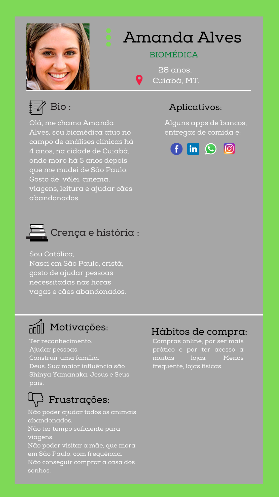
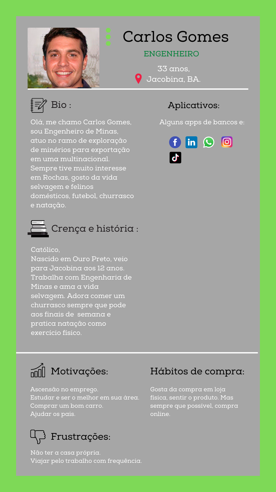
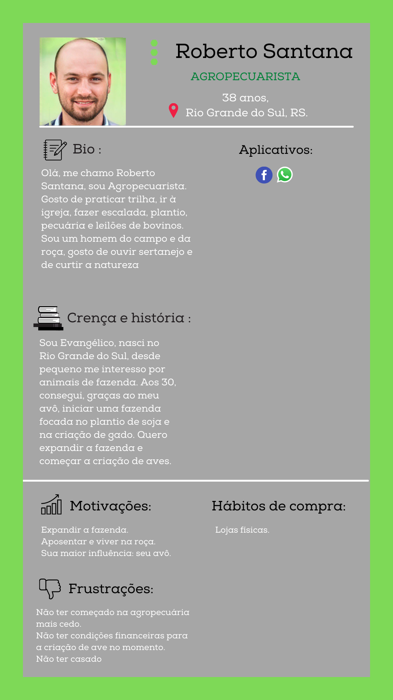

# Especificações do Projeto

Pré-requisitos: <a href="1-Documentação de Contexto.md"> Documentação de Contexto</a>

## Personas

As personas levantadas durante o processo de entendimento do problema são apresentadas nas figuras que se seguem:	

  

  
 

  
 

  
  

## Histórias de Usuários

A partir do entendimento do cotidiano das personas determinadas pelo projeto, são registradas as seguintes histórias de usuários.

|EU COMO... `PERSONA`| QUERO/PRECISO ... `FUNCIONALIDADE`|  PARA ... `MOTIVO/VALOR`|
|--------------------|----------------------------------------|-------------------------|
|   Cris da Silva    |Me informar a respeito de animais domésticos.|Cuidar do meu gato|
|   Cris da Silva    |Material em português.|Compreensão mais rápida e melhor.|
|   Amanda Alves     |Quero a fonte das informações|Confiar no conteúdo passado.|Confiar no conteúdo passado.|
|   Amanda Alves     |Poder realizar uma pesquisa acerca de espécies específicas|Localizar espécies específicas e ter mais objetividade na pesquisa|
|   Roberto Santana  |Ter acesso tanto no desktop, quanto no celular.|Passar tempo enquanto espero algo (ex: filas do banco).|
|   Roberto Santana  |Ler a respeito da avicultura.|Posterior investimento.|
|   Cris da Silva    |Ilustrações (imagens, gráficos e textos).|Melhor interpretação.|
|   Roberto Santana  |Saber as doenças mais comuns num rebanho.|Prevenção e tratamento adequado.|
|   Amanda Alves     |Indicações de sites de adoção de animais.|Pretendo adotar um animal de estimação.|
|   Carlos Gomes     |Um site com informações claras, sem poluição visual.|Para ficar fácil a navegação e entendimento do conteúdo.|
=======

## Requisitos

Os requisitos do projeto são divididos em dois grupos, os funcionais e os não funcionais, conforme as tabelas abaixo.

### Requisitos Funcionais
A tabela a seguir apresenta os requisitos funcionais do projeto, identificando a prioridade em que os mesmos devem ser entregues.

|ID    | Descrição do Requisito  | Prioridade |
|------|-----------------------------------------|----|
|RF-01|O site deve apresentar informações sobre três grandes categorias de animais (silvestres, domésticos e de criação).| ALTA | 
|RF-02|O site deve apresentar as fontes de onde as informações foram retiradas.| BAIXA |
|RF-03|O site deve oferecer a função de pesquisa para o usuário buscar informações sobre espécies específicas.| ALTA |
|RF-04|O site deve fornecer imagens e gráficos junto ao conteúdo informativo sobre as espécies.| MÉDIO |
|RF-05|O site deve fornecer informações a respeito de ongs de adoção de animais.| BAIXO |

### Requisitos não Funcionais
A tabela a seguir apresenta os requisitos não funcionais que o projeto deverá atender:

| ID     | Descrição do Requisito                                                                                        | Prioridade |
| ------ | ------------------------------------------------------------------------------------------------------------- | ---------- |
| RNF-01 | O site deve ser publicado em um ambiente acessível publicamente na Internet (Repl.it, GitHub Pages, Heroku).  | ALTA       |
| RNF-02 | O site deverá ser responsivo, permitindo a visualização em um celular de forma adequada.                      | MÉDIO      |
| RNF-03 | O site deve apresentar conteúdo em português.                                                                 | BAIXA      |
| RNF-04 | O site deve ser compatível com os principais navegadores do mercado (Google Chrome, Firefox, Microsoft Edge). | ALTA       |
| RNF-05 | O site deve ser desenvolvido com layout clean e organizado para o usuário.                                    | MÉDIO      |

## Restrições

O projeto está restrito pelos itens apresentados na tabela a seguir.

| ID    | Restrição                                                                 |
| ----- | ------------------------------------------------------------------------- |
| RE-01 | O projeto deverá ser entregue até o final do semestre                     |
| RE-02 | O aplicativo deve se restringir às tecnologias básicas da Web no Frontend |
| RE-03 | A equipe não pode subcontratar o desenvolvimento do trabalho.             |
