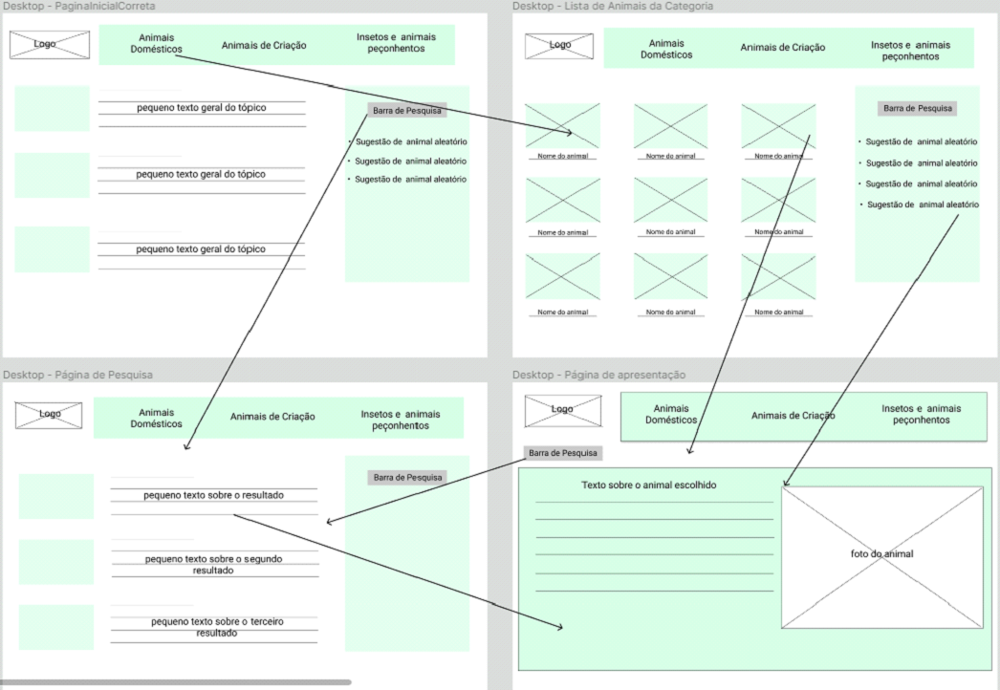
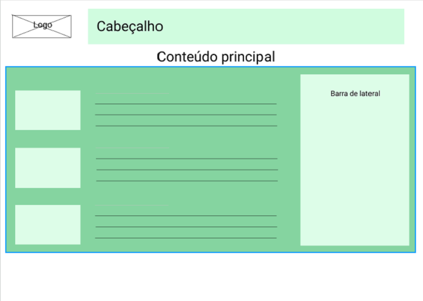

# Projeto de Interface

Pré-requisitos: <a href="2-Especificação do Projeto.md"> Documentação de Especificação</a>

Na atenção à montagem da interface do sistema, nos concentramos em questões como agilidade, acessibilidade e usabilidade. Dessa forma, o projeto possui uma identidade visual padronizada em todas as telas projetadas para desktops e dispositivos móveis.

 Apresenta as principais interfaces da plataforma. Discuta como ela foi elaborada de forma a atender os requisitos funcionais, não funcionais e histórias de usuário abordados nas <a href="2-Especificação do Projeto.md"> Documentação de Especificação</a>.

## User Flow
O diagrama da figura X mostra o fluxo da interação do usuário nas telas do sistema. Cada tela neste processo é descrita em detalhes na seção wireframes a seguir. 
Para visualizar o fluxo total interativo visite o link: 

https://www.figma.com/proto/RVVY9vUzOz2UAcDXo3sfMQ/Wireframe-Animais

 

## Wireframes

De acordo com o fluxo da tela do projeto introduzido no item anterior, a tela do sistema será descrita detalhadamente nos itens a seguir. 
A tela do sistema possui uma estrutura geral conforme mostrado na Figura. Nessa estrutura, existem 3 grandes blocos, conforme descrito a seguir. Eles são:

● Cabeçalho - local onde são exibidos os elementos fixos de identificação (logotipo) e a navegação no site principal (menu de navegação);

● Conteúdo - exibe o conteúdo da tela relevante ao centro, e na lateral esquerda imagens;

● Barra lateral - exibe elementos de pesquisa, elementos de navegação secundários, geralmente associados a elementos de bloco de conteúdo.

