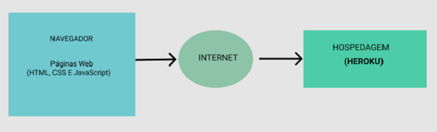

# Arquitetura da Solução

Pré-requisitos: <a href="3-Projeto de Interface.md"> Projeto de Interface</a>

Nesta seção são apresentados os detalhes técnicos da solução criada pela equipe, tratando dos componentes que fazem parte da solução e do ambiente de hospedagem da solução.

## Diagrama de componentes

Os componentes que fazem parte da solução são apresentados na Figura que se segue.

Figura X - Arquitetura da Solução

A solução implementada conta com os seguintes módulos:

 ● **Navegador** - Interface básica do sistema 

 ● **Páginas Web** - Conjunto de arquivos HTML, CSS, JavaScript e imagens que implementam as funcionalidades do sistema.

 ● **Hospedagem** - local na Internet onde as páginas são mantidas e acessadas pelo navegador. 

## Hospedagem

O site utiliza a plataforma do Heroku como ambiente de hospedagem do site do projeto. O site é mantido no ambiente da URL: 

https://link_exemplo.herokuapp.com 

A publicação do site no Heroku é feita por meio de uma submissão do projeto (push) via git para o repositório remoto que se encontra no endereço: 

https://github.com/ICEI-PUC-Minas-PMV-ADS/pmv-ads-2021-2-e1-proj-web-t1-grupo-1-animais.git

