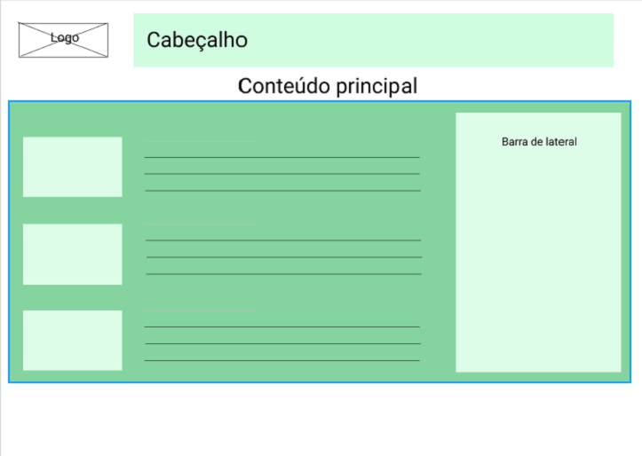

# Template padrão do site

Pré-requisitos: <a href="2-Especificação do Projeto.md"> Especificação do Projeto</a>, <a href="3-Projeto de Interface.md"> Projeto de Interface</a>, <a href="4-Metodologia.md"> Metodologia</a>
Template do site

O  padrão  de  layout  a  ser  utilizado  pelo  site  tem  correspondência  ao  projeto  de  Interface 
elaborado anteriormente, conforme Figura X.

Figura X - Template padrão do site

O template criado está disponível no site https://github.com/ICEI-PUC-Minas-PMV-ADS/pmv-ads-2021-2-e1-proj-web-t1-grupo-1-animais.git  e é composto pelos seguintes layouts: 

● Tela principal

Tela Principal
Tela que abrange todas as visualizações iniciais do site e a lista de notícias gerais.
